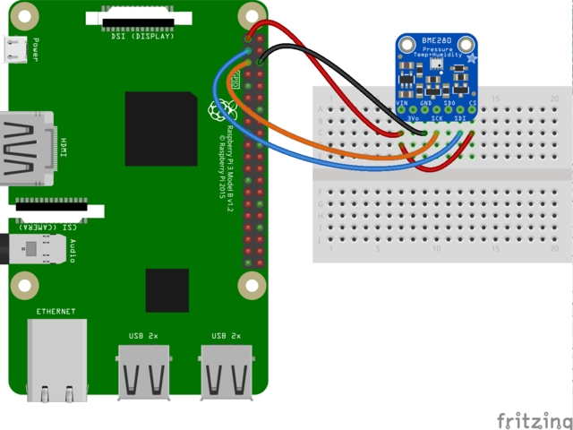

[![Contributors][contributors-shield]][contributors-url]
[![Forks][forks-shield]][forks-url]
[![Stargazers][stars-shield]][stars-url]
[![Issues][issues-shield]][issues-url]
[![MIT License][license-shield]][license-url]


<p align="center">

  <h3 align="center">BME280ctl</h3>

  <p align="center">
BME280ctl is a self-hosted Telegram bot on Raspberry Pi that is used to retrieve temperature, humidity, and pressure data from the BME280 sensor.
    <br />
    <a href="https://github.com/feux07/bme280ctl/issues">Report Bug</a>
    ·
    <a href="https://github.com/feux07/bme280ctl/issues">Request Feature</a>
  </p>
</p>


<!-- TABLE OF CONTENTS -->
## Table of Contents

- [Table of Contents](#table-of-contents)
- [Getting Started](#getting-started)
  - [Prerequisites](#prerequisites)
  - [Wiring with I2C](#wiring-with-i2c)
  - [Installation](#installation)
- [Usage](#usage)
- [Resources](#resources)
- [License](#license)
- [Contact](#contact)


<!-- GETTING STARTED -->
## Getting Started

### Prerequisites

* Raspberry Pi
* BME280 Sensor
* NodeJS version >= 12.18.2
* [Telegram Bot with API Token](https://core.telegram.org/bots#3-how-do-i-create-a-bot)
* Docker version >= 19.03 (optional)

### Wiring with I2C




* RPI 3V3 to sensor VIN
* RPI 3V3 to sensor CS
* RPI GND to sensor GND
* RPI SCL to sensor SCK
* RPI SDA to sensor SDI


### Installation
 
1. Clone the repo
```sh
git clone https://github.com/feux07/bme280ctl.git
```
2. Go to project directory
```sh
cd bme280ctl
```

3. Install NPM packages
```sh
npm install
```

<!-- USAGE EXAMPLES -->
## Usage

1. Create .env file with following environment variables 
```sh
TELEGRAM_BOT_TOKEN = YOUR_TELEGRAM_BOT_TOKEN
TELEGRAM_TARGET_CHAT_ID = YOUR_TELEGRAM_TARGET_CHAT_ID
TELEGRAM_ADMIN_USER=YOUR_TELEGRAM_ADMIN_USERNAME
READ_SENSOR_CRON_EXP="* * * * *"
SCHEDULED_NOTIFICATION_CRON_EXP="0 7 * * *"
```

2. Start application with following command

```sh
node start.js
```

* Or start with Docker Compose

```sh
docker-compose up -d
```

## Resources

* [ Adafruit BME280 Humidity + Barometric Pressure + Temperature Sensor Breakout ]( https://learn.adafruit.com/adafruit-bme280-humidity-barometric-pressure-temperature-sensor-breakout)

<!-- LICENSE -->
## License

Distributed under the MIT License. See `LICENSE` for more information.


<!-- CONTACT -->
## Contact

[Website](https://fethierdincuzun.com)


<!-- MARKDOWN LINKS & IMAGES -->
<!-- https://www.markdownguide.org/basic-syntax/#reference-style-links -->
[contributors-shield]: https://img.shields.io/github/contributors/feux07/bme280ctl.svg?style=flat-square
[contributors-url]: https://github.com/feux07/bme280ctl/graphs/contributors
[forks-shield]: https://img.shields.io/github/forks/feux07/bme280ctl.svg?style=flat-square
[forks-url]: https://github.com/feux07/bme280ctl/network/members
[stars-shield]: https://img.shields.io/github/stars/feux07/bme280ctl.svg?style=flat-square
[stars-url]: https://github.com/feux07/bme280ctl/stargazers
[issues-shield]: https://img.shields.io/github/issues/feux07/bme280ctl.svg?style=flat-square
[issues-url]: https://github.com/feux07/bme280ctl/issues
[license-shield]: https://img.shields.io/github/license/feux07/bme280ctl.svg?style=flat-square
[license-url]: https://github.com/feux07/bme280ctl/blob/master/LICENSE
